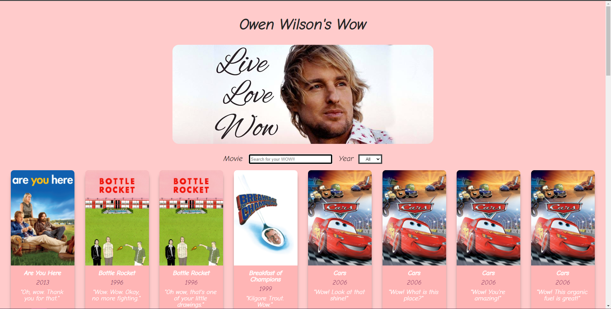

<h1 align="center">Hola 👋!! Soy Marta</h1>
<h3 align="center">Estudiante en Adalab de Frontend, soy de Madrid y esta es mi evaluación final del módulo de React en Adalab.</h3>

## En qué consiste el ejercicio:

Este ejercicio de evaluación consiste en desarrollar una página web con el listado de las escenas de las películas donde el
actor Owen Wilson ha dicho 'wow', y la API Wow de Owen Wilson es la API que usaremos en este ejercicio.

### Para realizarlo:
He usado mi propio React Starter Kit y he implementado lo que se pedía:

1. Listado de escenas
En primer lugar, vamos a realizar una web con el listado de 50 escenas donde el actor Owen Wilson ha
dicho 'wow'.

2. Filtrado por película
Ahora que ya tenemos el listado de escenas, la segunda parte consiste en realizar un filtro para buscar por
película. Para eso, añadimos un input a la interfaz, de forma que al ir escribiendo un nombre queden en la
interfaz solo las escenas cuya película contiene las letras escritas.

3. Filtrado por año
Ahora que ya tenemos el listado de escenas en pantalla, y filtrado por nombre de la película donde aparece
la escena, la siguiente parte consiste en filtrar el listado por año de la película. Para eso, añadimos un
select a la interfaz, de forma que al seleccionar un año queden en la interfaz solo las escenas que
coincidan con el año seleccionado.

4. Componentes de la aplicación
La aplicación debe tener los siguientes componentes como mínimo:
Componente para los filtros.
Componente para el listado (MovieSceneList).
Componente para la tarjeta de cada escena del listado (MovieSceneItem).
Componente para el detalle de cada escena del listado (MovieSceneDetail).

5. Detalle de cada escena
Vamos a implementar una nueva funcionalidad: al hacer clic sobre la tarjeta de una escena, su información
aparecerá a pantalla completa. Para hacer esto usaremos rutas y React Router DOM. En la pantalla de
detalle aparecerá:
nombre de la película,
frase completa
director
el enlace del audio de la escena, al darle clic debe mostrarse en una pestaña aparte en el navegador.

6. Detallitos de calidad
    * Como nos gusta cuidar la semántica, el campo de texto debe estar recubierto por una etiqueta "form"
    * Si estando en el campo de filtrado pulsamos intro debéis impedir que el navegador navegue o cambie
    la ruta sin querer.
    * Si se busca por un texto por ejemplo "ZZZ" y no hay ninguna escena de película que coincida con
    dicho texto se debe mostrar un mensaje del tipo "No hay ninguna nombre de película que coincida
    con la palabra ZZZ".
    * El filtro debe filtrar independientemente de que la usuaria introduzca el texto en mayúsuclas o
    minúsculas. 
    * Al entrar en el detalle de un escena y a continuación pulsar atrás, el campo de texto debe mostrar el
    texto que tenía anteriormente.

7. BONUS: Mejoras visuales
Para terminar, podéis realizar algunas mejoras visuales del ejercicio. Por ejemplo:
    * Poner bonita tu web y agregar el estilo que desees.
    * Agregar iconos a la información que se muestre en el detalle de las escenas.
    * Usar algún sistema de grid para pintar el listado.
    Que funcione bien el responsive en dispositivos pequeños.

8. BONUS: URL compatible
Como ejercicio extra os proponemos que la URL del detalle de cada escena sea compatible, es decir,
que si visitamos esa URL directamente en el navegador se vea el detalle de la escena de una película.
Si refrescamos el navegador en el detalle de una escena de la película debe volver a mostrar el
detalle de la película, solo si está almacenado en el local storage.
Y en el caso de que el usuario navegue a una URL inexistente como por ejemplo
http://localhost:3000/detail/12345 (el id 12345 no existe) debemos mostrar un mensaje
del tipo "La escena que buscas no existe".

9. BONUS: Ordenación
Un extra interesante sería que ordenáseis el listado de escenas alfabéticamente por el nombre de la
película.

### Tecnologías usadas:

<h3 align="left">Languages and Tools:</h3>

        

<h3 align="left">Contáctame:</h3>

